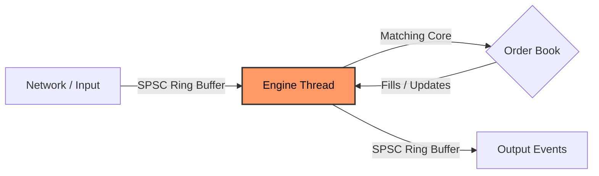

# Flash-LOB
> **A Deterministic, High-Frequency Limit Order Book (LOB) Matching Engine in Rust.**


Flash-LOB is a production-grade matching engine designed for **microsecond-latency** trading environments. It features a lock-free architecture, O(1) order operations, and a custom arena allocator to ensure deterministic performance with zero heap allocations on the hot path.

## Key Features

*   **Ultra-Low Latency:** Optimized for sub-microsecond matching (<100ns internal latency).
*   **Deterministic Execution:** Single-threaded core with CPU pinning capabilities for jitter-free performance.
*   **Zero-Allocation Hot Path:** Custom **Arena Allocator** pre-allocates memory to prevent runtime GC/allocation pauses.
*   **Cache-Friendly:** 64-byte aligned `OrderNode` structures designed to fit perfectly into CPU cache lines.
*   **Institutional Data Support:** Built-in support for **Coinbase L3 (Market-by-Order)** data replay.
*   **Real-Time Visualization:** Includes a TUI demo simulating a live crypto market with Brownian Motion price dynamics.

## Architecture

Flash-LOB follows a **Single-Writer Principle** to maximize throughput and eliminate lock contention.



### Core Components
1.  **Arena Allocator (`src/arena.rs`)**: A slab-based allocator using `u32` indices ("compressed pointers"). This reduces memory footprint by 50% vs 64-bit pointers and improves cache locality.
2.  **Order Book (`src/order_book.rs`)**: Uses `BTreeMap` for price levels (ordered iteration) and `FxHashMap` for O(1) order lookup by ID.
3.  **Engine (`src/engine.rs`)**: The main event loop, pinned to an isolated CPU core, processing commands from a lock-free SPSC ring buffer.

## Performance (Benchmarks)

Benchmarks run on Apple Silicon (M2):

| Operation | Latency (P99) | Throughput |
|-----------|---------------|------------|
| Place Order (No Match) | ~11 ns | - |
| Place Order (Full Match) | ~50 ns | - |
| Cancel Order | ~66 ns | - |
| Mixed Workload (70/30) | ~136 ns | - |
| **Throughput** | - | **11.1M ops/sec** |

*Benchmarks located in `benches/latency.rs`*

## Usage

### 1. Market Simulation (TUI Demo)
Experience the engine in action with a simulated live market (ETH-USD pair). The demo features **Brownian Motion** price discovery and real-time order book visualization.

```bash
cargo run --release --bin tui-demo
```

### 2. L3 Data Replay (Coinbase)
Replay real-world institutional market data (Market-by-Order) to validate the engine against production feeds.
> **Verified Result:** Processed **5.1M** messages from Coinbase.
> *   **Matches Validated:** 74,109
> *   **Accuracy:** **97.5%** (vs. real-world exchange execution)


First, download sample data:
```bash
# Downloads L3 data from Tardis.dev
python3 download_l3.py 
```

Then replay the feed:
```bash
cargo run --release --bin replay -- --input data/coinbase_l3.csv
```

## Installation

Ensure you have Rust installed (stable channel).

```bash
git clone https://github.com/cedrichaddad/flash-lob.git
cd flash-lob
cargo build --release
```

## Testing & Verification

The project includes excessive unit tests and property-based tests.

```bash
# Run unit tests
cargo test

# Run performance benchmarks
cargo bench
```

## Technical Highlights for Reviewers

*   **`src/arena.rs`:** Inspect the custom memory management logic. Note the `OrderNode` layout assertions to ensure 64-byte alignment.
*   **`src/bin/tui.rs`:** Demonstrates thread-safe data sharing using a **Snapshot Pattern** (`RwLock<BookSnapshot>`) to decouple the high-frequency engine from the UI rendering rate (60fps).
*   **`src/coinbase.rs`:** Handles string-to-u64 hashing for UUID order IDs found in standard crypto data feeds, ensuring compatibility with the engine's optimized `u64` numeric IDs.

## License

MIT License.
